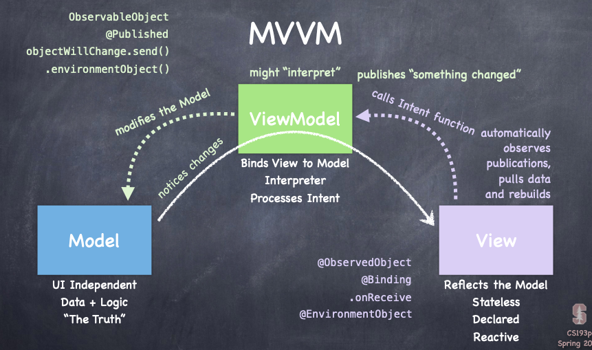
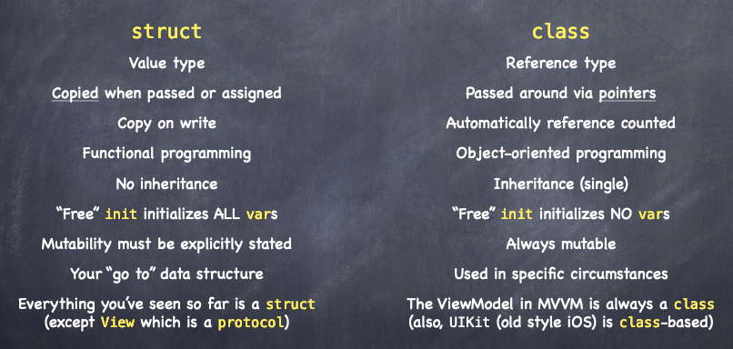

# Lecture 2 - MVVM + Swift Type
## MVVM
* A 'code organising' design paradigm

* **MVVM** : Model + View + ViewModel

### Model

* Data + Logic

### View

* Reflects the model (Stateless, reactive & declared)

* What you see (observes publications)
  * `@ObservedObject`
  * `@Binding`
  * `@EnvironementObject`
  * `.onreceive`

### ViewModel 

* Notices changes in Model & **Publishes changes** to View
  * `ObservableObject`
  * `@Published`
  * `.environementObject()`
  * `objectWillChange.send()`
* Processes **Intent** from View using functions within & Modifies the Model




## Types
### struct & class
**Similarities**: Stored & Computed var, lets, funcs, inits

**Differences**:



**Structs**

* **Copied** when passed 
* Free init initalises all vars, 
* Mutability must be stated - var & let

**Classes**

* **Referenced** by pointers 
* Free init initialises no vars - Need to declare variables 
* Always mutable 
* **Always used for ViewModel** - Needs to be shared 

### Generics

* When you *don't care* about a type (**type agnostic**) - Eg. data inside Arrays

```swift
struct Array<Element> {
	// …
	func append(_ element: Element) { . . . }
}

var a = Array<Int>()
a.append(5)
```

* Can have multiple *don't care* type parameters  Eg. <Element, Foo>

### Functions

* Are types too

```swift
var foo: (Double) -> Double
// foo’s type: function that takes a Double, returns Double
```


## Demo 

* *Opt-click* for documentation

* Create an Empty Array: `var cards = Array<Card>()`

* ViewModel is a class to allow multiple Views to share / point to it

* In SceneDelegate.swift create the instance of the ViewModel & initialise the View

  ```swift
  let game = EmojiMemoryGame()
  let contentView = ContentView(viewModel: game)
  ```

* ForEach needs identifiable values

### House Analogy

* Views - living inside house, ViewModel - door, Model - outside world

* Problem of rogue view manipulating model

* `private var` - model can only be accessed by the ViewModel (closes the door)

* `private(set) var` - class can modify the model and View can still see model

* **Intents** - funcs that allow Views to access model (intercom buttons)

### Static Functions

* Removes the need to initialise the class variables inorder to use the function
* Static functions **belong to the type** (class/struct) and not the instance - Universal for all instances

```swift
class EmojiMemoryGame {
  	// Need to use class name to call function
  	private var model: MemoryGame<String> = EmojiMemoryGame.createMemoryGame()
    static func createMemoryGame() -> MemoryGame<String> {
    }
}
```

### Class Functions

* Like static functions but can be overwritten by subclasses.

### Closures

```swift
private var model: MemoryGame<String> = MemoryGame<String>(numberOfPairs: 2, cardContentFactory: { (pairIndex: Int) -> String in
		return “😋”
})
```

can become:

```swift
private var model: MemoryGame<String> = MemoryGame<String>(numberOfPairs: 2) { _ in “😋” }
```

