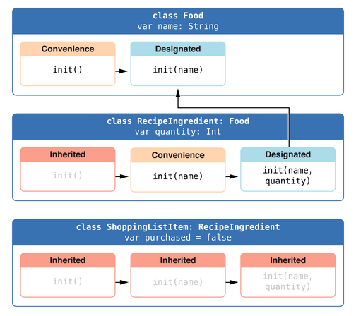

# Initialization
* _Initialization_ is the process of preparing an instance of a class, struct, or enum for use

* Sets an initial value for each stored property

  

## Setting Initial Values
* Can either use **init()** or **Default Prop Value** (ie. var temp = 32.0)
```swift
struct Fahrenheit {
    var temp: Double
    init() { temp = 32.0 }
}
var f = Fahrenheit()
print("The default temperature is \(f.temp)° Fahrenheit")
// Prints "The default temperature is 32.0° Fahrenheit"
```


## Custom Initialization

* Intialise using computation
* Argument labels are provided & can use _ too
```swift
struct Celsius {
    var temperatureInCelsius: Double
    init(fromFahrenheit fahrenheit: Double) {
        temperatureInCelsius = (fahrenheit - 32.0) / 1.8
    }
    init(fromKelvin kelvin: Double) {
        temperatureInCelsius = kelvin - 273.15
    }
    init(_ celsius: Double) {                      // Labels not required
        temperatureInCelsius = celsius
    }

}
let boilingPointOfWater = Celsius(fromFahrenheit: 212.0)
// boilingPointOfWater.temperatureInCelsius is 100.0
let freezingPointOfWater = Celsius(fromKelvin: 273.15)
// freezingPointOfWater.temperatureInCelsius is 0.0
let bodyTemperature = Celsius(37.0)
// bodyTemperature.temperatureInCelsius is 37.0
```

### Optional Property Types
* use optionals if not necessary for property to be set `var response: String?`

  

## Init Delegation for Value Types
* Call **other initializers** (self.init) to perform instance initialization
* Essentially to use different parameters to form same instance
```swift
struct Size {
    var width = 0.0, height = 0.0
}
struct Point {
    var x = 0.0, y = 0.0
}

struct Rect {
    var origin = Point()
    var size = Size()
    init() {}  													// Default init with value = 0 as in structs
    init(origin: Point, size: Size) {  	// Custom init
        self.origin = origin
        self.size = size
    }
    init(center: Point, size: Size) {  	// Init delegation
        let originX = center.x - (size.width / 2)
        let originY = center.y - (size.height / 2)
        self.init(origin: Point(x: originX, y: originY), size: size) // calls the other init
    }
}

let basicRect = Rect()																// Default init

let originRect = Rect(origin: Point(x: 2.0, y: 2.0),	// Custom init
                      size: Size(width: 5.0, height: 5.0))

let centerRect = Rect(center: Point(x: 4.0, y: 4.0),  // Delegated init
                      size: Size(width: 3.0, height: 3.0))
```


## Class Inheritance

* All class properties must be assigned an intial value during inits

### Designated / Convenience Initializers

* *Designated*: **Primary** init, fully **inits all properties** by that class and calls a superclass init (**delegate up**)
  * Usually class have 1 Designated init
  * Written same way as normal inits
* *Convenience*: **Seconday** init, supporting Init, for same class (**delegate across**)
  * `convenience` modifier before init
  * Ultimately calls a designated init
  * Use when there is a default value for a property
```swift
class Food {
    var name: String
	  // Designated init
    init(name: String) { self.name = name }
    // Convenience init
    convenience init() { self.init(name: "[Unnamed]") }
}
```


```swift
class RecipeIngredient: Food {
    var quantity: Int
    init(name: String, quantity: Int) {
        self.quantity = quantity
        super.init(name: name)
    }
    override convenience init(name: String) {
        self.init(name: name, quantity: 1)
    }
}

class ShoppingListItem: RecipeIngredient {
    var purchased = false
    var description: String {
        var output = "\(quantity) x \(name)"
        output += purchased ? " ✔" : " ✘"
        return output
    }
}

ShoppingListItem(name: "Bacon")
```



### Init Inheritance + Overriding
```swift
class Vehicle {
    var numberOfWheels = 0
    var description: String {
        return "\(numberOfWheels) wheel(s)"
    }
}

class Bicycle: Vehicle {
    override init() {
        super.init()     // Calls the Vehicle init
        numberOfWheels = 2
    }
}

class Hoverboard: Vehicle {
    var color: String
    init(color: String) {
        self.color = color
        // super.init() implicitly called here as not changing superclass value
    }
    override var description: String {
        return "\(super.description) in a beautiful \(color)"
    }
}
```


## Failable Inits

* To cope with init conditions that can fail `init?` - creates an Optional Value Type
* Can use for enum switch cases too (if rawValue auto receives failable init)
```swift
struct Animal {
    let species: String   // No '?' yet Optional Type will be created
    init?(species: String) {
        if species.isEmpty { return nil }
        self.species = species
    }
}
let anonymousCreature = Animal(species: "")
// anonymousCreature is of type Animal?, not Animal

if anonymousCreature == nil {
    print("The anonymous creature cannot be initialized")
}
// Prints "The anonymous creature cannot be initialized"
```


## Required Inits

* Indicates every **subclass must implement** that init 
* Use `required` for both classes
```swift
class SomeClass {
    required init() {
        // initializer implementation goes here
    }
}
class SomeSubclass: SomeClass {
    required init() {
        // subclass implementation of the required initializer goes here
    }
}
```


## Setting a Default Property Value with Closure / Function

* If stored prop default value requires some customization or setup, you can use a  closure or global function to provide a customized default value for  that prop

```swift
class SomeClass {
    let someProperty: SomeType = {
        // create a default value for someProperty inside this closure
        // someValue must be of the same type as SomeType
        return someValue
    }()
}
```

* Parentheses () after tells swift to execute the closure immediately

```swift
struct Chessboard {
    let boardColors: [Bool] = {             // Start of Closure
        var temporaryBoard = [Bool]()
        var isBlack = false
        for i in 1...8 {
            for j in 1...8 {
                temporaryBoard.append(isBlack)
                isBlack = !isBlack
            }
            isBlack = !isBlack
        }
        return temporaryBoard								// Closure returns
    }()
    func squareIsBlackAt(row: Int, column: Int) -> Bool {
        return boardColors[(row * 8) + column]
    }
}
```

