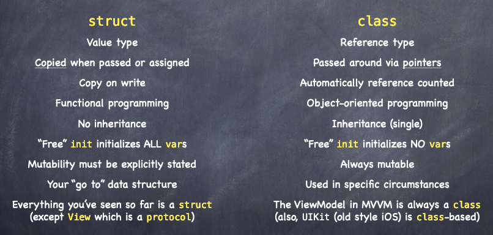

# Lecture 2 - MVVM + Swift Type
## MVVM
**MVVM** : Model + View + ViewModel

### Model

* Data + Logic

### View

* Reflects the model (Stateless, reactive & declared)

* What you see (observes publications)
  * @ObservedObject
  * @Binding
  * @EnvironementObject
  * .onreceive

### ViewModel: 

* Interpretor of Model 

* Publishes changes
  * ObservableObject
  * @Published
  * .environementObject()
  * objectWillChange.send()


## Types
### Struct & Class
**Similarities**: Stored, compted var, lets, funcs, inits

**Differences**:



**Structs**

* Copied when passed, init initalises all vars, mutability must be stated

**Classes**

* Passed by pointers,  init initialises no vars, always mutable
* **Always used for ViewModel**

### Generics

* When you dont care about a type (type agnostic) - Eg. data inside Arrays

```swift
struct Array<Element> {
	…
	func append(_ element: Element) { . . . }
}
var a = Array<Int>()
a.append(5)
```

* Can have multiple don't care type parameters  Eg. <Element, Foo>

### Functions

* Are types too!

```swift
var foo: (Double) -> Void
```

* foo’s type: function that takes a Double, returns nothing

## Demo 

* Opt-click for documentation
* Empty Array: `cards = Array<Card>()`

### House Analogy

* Views - living inside house, ViewModel - door, Model - outside world

* Problem of rogue view manipulating model

* `private var` - model can only be accessed by the class (closes the door)

* `private(set)` - class can modify the model but View can still see model

* Intents - funcs that allow Views to access model (intercom buttons)

### Static Functions

```swift
class AppUtils {
    static func appUtility() {
    }
}
```

* Dont need instance. Access static func as `AppUtils.appUtility()`

### Class Functions

* Like static functions but can be overwritten by subclasses.

### Closures

```swift
private var model: MemoryGame<String> = MemoryGame<String>(numberOfPairs: 2, cardContentFactory: { (pairIndex: Int) -> String in
        return “😋”
    })
```

can become:

```swift
private var model: MemoryGame<String> = MemoryGame<String>(numberOfPairs: 2) { _ in “😋” }
```

